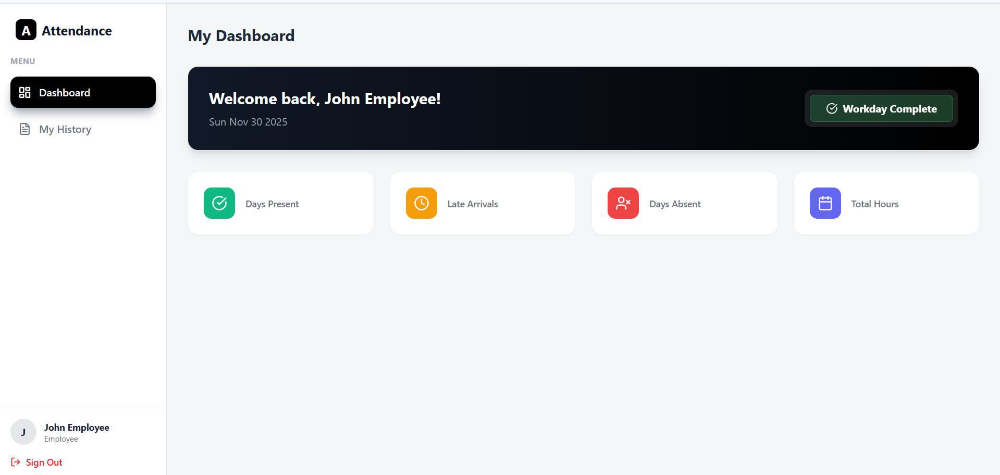

1. NAME = B Keerthi  
 2 .Collage = Srinivasa Ramanujan Institute of technology 
  3. Contact Number = 8688853421


Employee Attendance System

A full-stack MERN application for tracking employee attendance, managing leaves, and generating reports. The system features role-based access control for Employees and Managers.


🚀 Live Demo
- **Frontend (Render): https://employee-attendance-2-l796.onrender.com
- **Backend (Render): https://employee-attendance-3.onrender.com

🛠 Tech Stack
- **Frontend:** React.js, Tailwind CSS, Recharts, Lucide React
- **Backend:** Node.js, Express.js
- **Database:** MongoDB Atlas
- **Authentication:** JWT (JSON Web Tokens)

✨ Features
**Employee:**
- Register/Login securely.
- Mark Daily Attendance (Check In / Check Out).
- View Personal Attendance History.
- Dashboard with Real-time Stats.

**Manager:**
- View All Employees.
- Monitor Team Attendance (Present, Late, Absent).
- Visual Analytics (Bar Charts & Pie Charts).
- Export Attendance Reports to CSV.

📸 Screenshots
### Dashboard for Manager


### Dashboard for Employee


### Login page 


### Register page


### Reports page


⚙️ Environment Variables

To run this project locally, you will need to add the following environment variables to your `.env` file in the `backend` folder.

`PORT` = 5000
`MONGO_URI` = mongodb+srv://admin:<Password123>@cluster0.iquj0au.mongodb.net/?appName=Cluster0
`JWT_SECRET` = 123456

## 💻 Setup & Installation
### 1. Clone the Repository
```bash
git clone https://github.com/YOUR_USERNAME/attendance-system.git
cd attendance-system

2. Backend Setup
cd backend
npm install

Seed the Database (Create Sample Users):  node seed.js

Start the Server: npm run start


How to Run
1. Ensure MongoDB is running (or connected via Cloud URI).
2. Start Backend (npm run start in /backend).
3. Start Frontend (npm run dev in /frontend).
4. Open your browser at http://localhost:5173.
5. Login Credentials:
6. Manager: manager@admin.com /  password = 123456
7. Employee: john@emp.com / password = 123456

